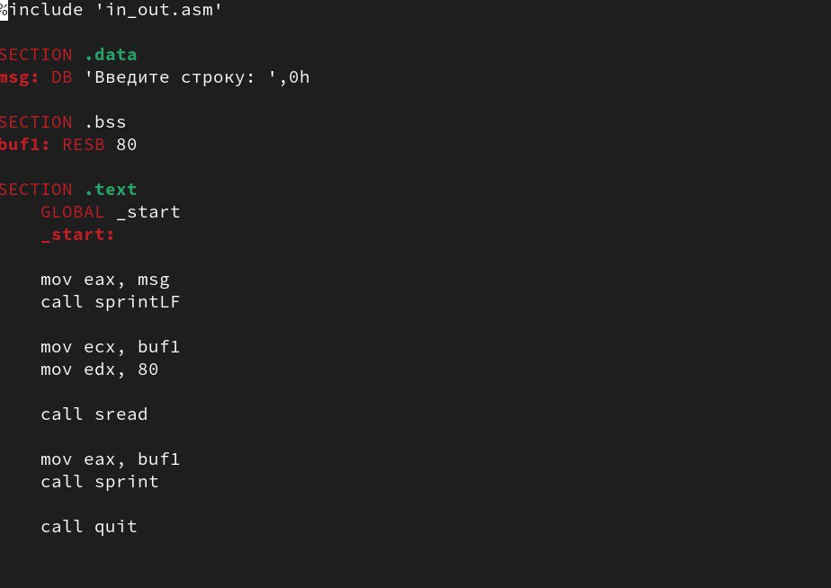

---
## Front matter
title: "Отчет лабораторной работы №5"
subtitle: "Основы работы с
Midnight Commander (mc). Структура программы на
языке ассемблера NASM."
author: "Аджигалиева Амина Руслановна"

## Generic otions
lang: ru-RU
toc-title: "Содержание"

## Bibliography
bibliography: bib/cite.bib
csl: pandoc/csl/gost-r-7-0-5-2008-numeric.csl

## Pdf output format
toc: true # Table of contents
toc-depth: 2
lof: true # List of figures
fontsize: 12pt
linestretch: 1.5
papersize: a4
documentclass: scrreprt
## I18n polyglossia
polyglossia-lang:
  name: russian
  options:
	- spelling=modern
	- babelshorthands=true
polyglossia-otherlangs:
  name: english
## I18n babel
babel-lang: russian
babel-otherlangs: english
## Fonts
mainfont: IBM Plex Serif
romanfont: IBM Plex Serif
sansfont: IBM Plex Sans
monofont: IBM Plex Mono
mathfont: STIX Two Math
mainfontoptions: Ligatures=Common,Ligatures=TeX,Scale=0.94
romanfontoptions: Ligatures=Common,Ligatures=TeX,Scale=0.94
sansfontoptions: Ligatures=Common,Ligatures=TeX,Scale=MatchLowercase,Scale=0.94
monofontoptions: Scale=MatchLowercase,Scale=0.94,FakeStretch=0.9
mathfontoptions:
## Biblatex
biblatex: true
biblio-style: "gost-numeric"
biblatexoptions:
  - parentracker=true
  - backend=biber
  - hyperref=auto
  - language=auto
  - autolang=other*
  - citestyle=gost-numeric
## Pandoc-crossref LaTeX customization
figureTitle: "Рис."
tableTitle: "Таблица"
listingTitle: "Листинг"
lofTitle: "Список иллюстраций"
lolTitle: "Листинги"
## Misc options
indent: true
header-includes:
  - \usepackage{indentfirst}
  - \usepackage{float} # keep figures where there are in the text
  - \floatplacement{figure}{H} # keep figures where there are in the text
---

# Цель работы

Приобретение практических навыков работы в Midnight Commander. Освоение инструкций
языка ассемблера mov и int.

# Порядок выполнения лабораторной работы

Откроем Midnight Commander. (рис. [-@fig:001]).

{#fig:001 width=70%}

В каталоге ~/work/arch-pc создаем и переходим в папку lab05. (рис. [-@fig:002]).

{#fig:002 width=70%}

Пользуясь строкой ввода и командой touch создаем файл lab5-1.asm (рис. [-@fig:003]).

{#fig:003 width=70%}

Откроем файл lab5-1.asm для редактирования во встроенном редакторе и введем текст программы. (рис. [-@fig:004]).

{#fig:004 width=70%}

Откроем файл для просмотра и убедимся, что файл содержит текст программы. (рис. [-@fig:005]).

{#fig:005 width=70%}

Оттранслируем текст программы lab5-1.asm в объектный файл. Выполним компоновку объектного файла и запустим получившийся исполняемый файл. (рис. [-@fig:006]).

{#fig:006 width=70%}

Скачиваем файл in_out.asm со страницы курса в ТУИС. (рис. [-@fig:007]).

{#fig:007 width=70%}

Создаем копию файла lab5-1.asm с именем lab5-2.asm. (рис. [-@fig:008]).

{#fig:008 width=70%}

Исправим текст программы в файле lab5-2.asm с использованием подпрограмм из
внешнего файла in_out.asm (рис. [-@fig:009]) Создадим исполняемый файл и просмотрим его. (рис. [-@fig:010])

{#fig:009 width=70%}

{#fig:010 width=70%}

Запускаем программу (рис. [-@fig:011])

{#fig:011 width=70%}

В файле lab5-2.asm заменим подпрограмму sprintLF на sprint и проверим его работу. (рис. [-@fig:012]) (рис. [-@fig:013])

{#fig:012 width=70%}

{#fig:013 width=70%}

Мы видим, что sprint выводит все в одну линию, а sprintLF начинает с новой строки.

# Задание для самостоятельной работы

Создаем копию файла lab5-1.asm. (рис. [-@fig:014]) Внесите изменения в программу, так чтобы она работала по следующему алгоритму:
вывести приглашение типа “Введите строку:”;
ввести строку с клавиатуры;
вывести введённую строку на экран. (рис. [-@fig:015])

{#fig:014 width=70%}

{#fig:015 width=70%}

Проверяем работу программы (рис. [-@fig:016])

{#fig:016 width=70%}

Создаем копию файла lab5-2.asm. (рис. [-@fig:017]) Исправим текст программы с использование подпрограмм из внешнего файла in_out.asm, так чтобы она работала по следующему алгоритму: 
вывести приглашение типа “Введите строку:”;
ввести строку с клавиатуры;
вывести введённую строку на экран. (рис. [-@fig:018])

{#fig:017 width=70%}

{#fig:018 width=70%}

Проверяем работу программы (рис. [-@fig:019])

{#fig:019 width=70%}

# Выводы

Мы приобрели навыки работы с Midnight Commander и освоили инструкцию
mov.

