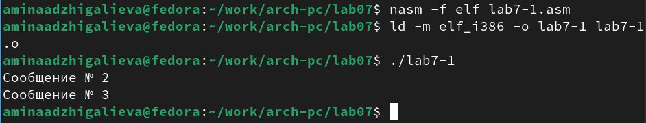

---
## Front matter
title: "Лабораторная работа №7. Команды безусловного и
условного переходов в Nasm. Программирование
ветвлений"
author: "Аджигалиева Амина Руслановна"

## Generic otions
lang: ru-RU
toc-title: "Содержание"

## Bibliography
bibliography: bib/cite.bib
csl: pandoc/csl/gost-r-7-0-5-2008-numeric.csl

## Pdf output format
toc: true # Table of contents
toc-depth: 2
lof: true # List of figures
fontsize: 12pt
linestretch: 1.5
papersize: a4
documentclass: scrreprt
## I18n polyglossia
polyglossia-lang:
  name: russian
  options:
	- spelling=modern
	- babelshorthands=true
polyglossia-otherlangs:
  name: english
## I18n babel
babel-lang: russian
babel-otherlangs: english
## Fonts
mainfont: IBM Plex Serif
romanfont: IBM Plex Serif
sansfont: IBM Plex Sans
monofont: IBM Plex Mono
mathfont: STIX Two Math
mainfontoptions: Ligatures=Common,Ligatures=TeX,Scale=0.94
romanfontoptions: Ligatures=Common,Ligatures=TeX,Scale=0.94
sansfontoptions: Ligatures=Common,Ligatures=TeX,Scale=MatchLowercase,Scale=0.94
monofontoptions: Scale=MatchLowercase,Scale=0.94,FakeStretch=0.9
mathfontoptions:
## Biblatex
biblatex: true
biblio-style: "gost-numeric"
biblatexoptions:
  - parentracker=true
  - backend=biber
  - hyperref=auto
  - language=auto
  - autolang=other*
  - citestyle=gost-numeric
## Pandoc-crossref LaTeX customization
figureTitle: "Рис."
tableTitle: "Таблица"
listingTitle: "Листинг"
lofTitle: "Список иллюстраций"
lolTitle: "Листинги"
## Misc options
indent: true
header-includes:
  - \usepackage{indentfirst}
  - \usepackage{float} # keep figures where there are in the text
  - \floatplacement{figure}{H} # keep figures where there are in the text
---

# Цель работы

Изучение команд условного и безусловного переходов. Приобретение навыков написания
программ с использованием переходов. Знакомство с назначением и структурой файла
листинга.

# Порядок выполнения лабораторной работы

## Реализация переходов в NASM

Создаем каталог для программам лабораторной работы № 7, перейдем в него и создаем файл lab7-1.asm: (рис. [-@fig:001]).

{#fig:001 width=70%}

Введем в файл lab7-1.asm текст программы из листинга. (рис. [-@fig:002]).

{#fig:002 width=70%}

Создадим исполняемый файл и запустим его. (рис. [-@fig:003]).

{#fig:003 width=70%}

Изменим программу таким образом, чтобы она выводила сначала ‘Сообщение № 2’, потом ‘Сообщение № 1’ и завершала работу (рис. [-@fig:004]).

{#fig:004 width=70%}

Создадим исполняемый файл и запустим его. (рис. [-@fig:005]).

{#fig:005 width=70%}

Изменим текст программы в соответствии с листингом 7.2. (рис. [-@fig:006]).

{#fig:006 width=70%}

Создадим исполняемый файл и запустим его. (рис. [-@fig:007]).

{#fig:007 width=70%}

Создаем файл lab7-2.asm в каталоге ~/work/arch-pc/lab07. (рис. [-@fig:008]).

{#fig:008 width=70%}

Запишем текст листинга в файл (рис. [-@fig:009]).

{#fig:009 width=70%}

Создадим исполняемый файл и запустим его. (рис. [-@fig:010]).

{#fig:010 width=70%}

## Изучение структуры файлы листинга

Создаем файл листинга для программы из файла lab7-2.asm (рис. [-@fig:011]).

{#fig:011 width=70%}

Откроем файл листинга lab7-2.lst с помощью любого текстового редактора, например mcedit: (рис. [-@fig:012]).

{#fig:012 width=70%}

Строка 29: 00000018 - адрес в сегменте кода, 89C2 - машинный код, mov edx, eax - перемещает содержимое регистра eax в регистр edx

Строк 30: 0000001А - адрес в сегменте кода, 58 - машинный код, pop eax - восстанавливает значение из стека в указанный регистр eax

Строка 32: 0000001B - адрес в сегменте кода, 89C1 - машинный код, mov ecx, eax - перемещает содержимое регистра eax в регистр ecx 

Откроем файл с программой lab7-2.asm и в любой инструкции с двумя операндами удалим один операнд. Выполним трансляцию с получением файла листинга: (рис. [-@fig:013]).

{#fig:013 width=70%}

## Задание для самостоятельной работы

Вариант 4.

Создаем файл: (рис. [-@fig:014]).

{#fig:014 width=70%}

Открываем его и пишем программу, которая выберет наименьшее число из трех (рис. [-@fig:015]).

{#fig:015 width=70%}

Создадим исполняемый файл и запустим его. (рис. [-@fig:016]).

{#fig:016 width=70%}

Создаем файл: (рис. [-@fig:017]).

{#fig:017 width=70%}

Открываем его и пишем программу, которая решит систему уравнений: (рис. [-@fig:018]).

{#fig:018 width=70%}

Создадим исполняемый файл и запустим его для (3;0) (рис. [-@fig:019]).

{#fig:019 width=70%}

Создадим исполняемый файл и запустим его для (3;2) (рис. [-@fig:020]).

{#fig:020 width=70%}

# Выводы

Мы познакомились с структурой файла листинга, изучили команды условного
и безусловного перехода.

