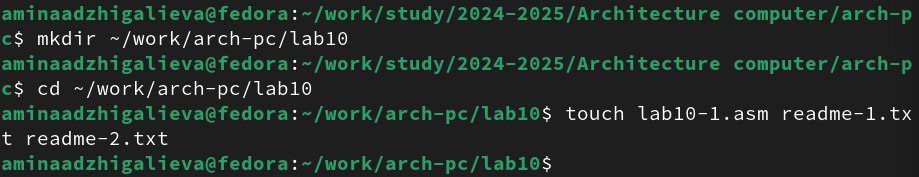
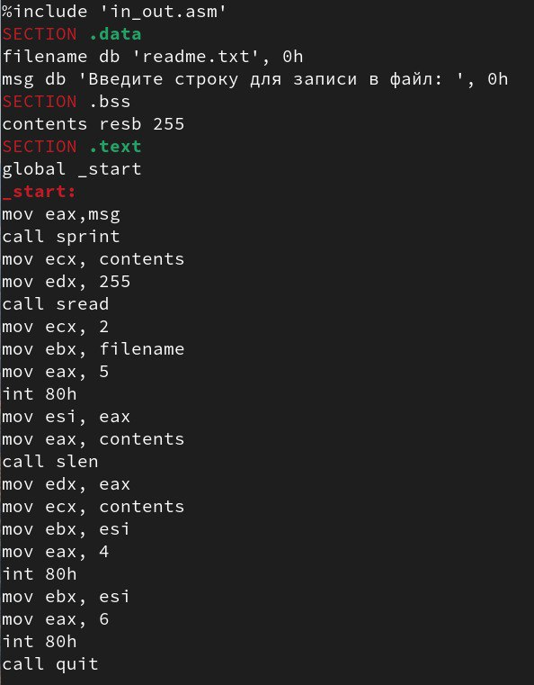
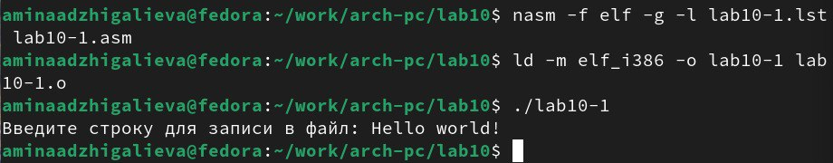
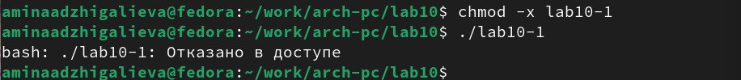
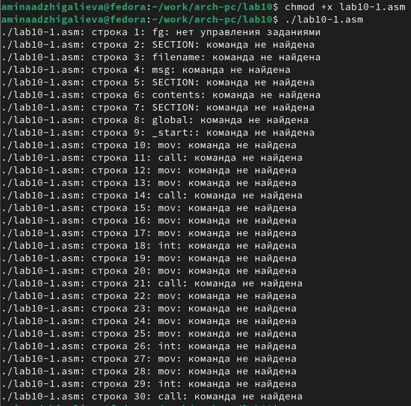
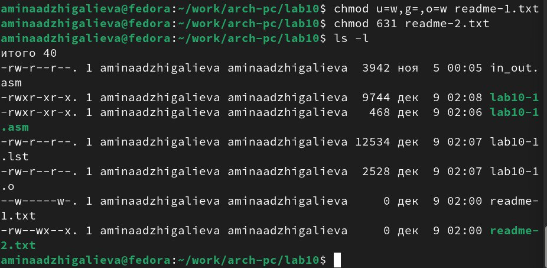
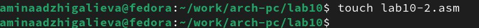
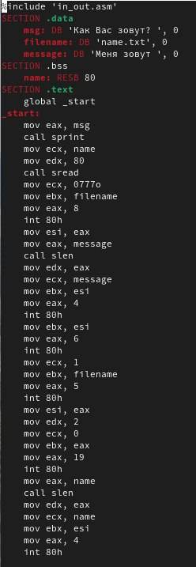
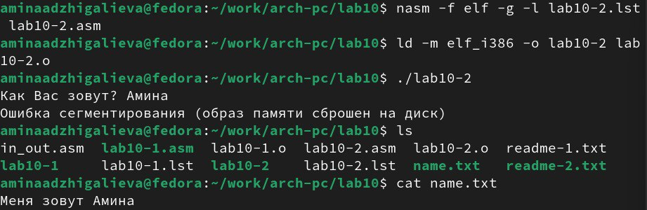

---
## Front matter
title: "Отчёт по лабораторной работе №10"
subtitle: "Работа с файлами средствами Nasm"
author: "Амина Аджигалиева"

## Generic otions
lang: ru-RU
toc-title: "Содержание"

## Bibliography
bibliography: bib/cite.bib
csl: pandoc/csl/gost-r-7-0-5-2008-numeric.csl

## Pdf output format
toc: true # Table of contents
toc-depth: 2
lof: true # List of figures
fontsize: 12pt
linestretch: 1.5
papersize: a4
documentclass: scrreprt
## I18n polyglossia
polyglossia-lang:
  name: russian
  options:
	- spelling=modern
	- babelshorthands=true
polyglossia-otherlangs:
  name: english
## I18n babel
babel-lang: russian
babel-otherlangs: english
## Fonts
mainfont: IBM Plex Serif
romanfont: IBM Plex Serif
sansfont: IBM Plex Sans
monofont: IBM Plex Mono
mathfont: STIX Two Math
mainfontoptions: Ligatures=Common,Ligatures=TeX,Scale=0.94
romanfontoptions: Ligatures=Common,Ligatures=TeX,Scale=0.94
sansfontoptions: Ligatures=Common,Ligatures=TeX,Scale=MatchLowercase,Scale=0.94
monofontoptions: Scale=MatchLowercase,Scale=0.94,FakeStretch=0.9
mathfontoptions:
## Biblatex
biblatex: true
biblio-style: "gost-numeric"
biblatexoptions:
  - parentracker=true
  - backend=biber
  - hyperref=auto
  - language=auto
  - autolang=other*
  - citestyle=gost-numeric
## Pandoc-crossref LaTeX customization
figureTitle: "Рис."
tableTitle: "Таблица"
listingTitle: "Листинг"
lofTitle: "Список иллюстраций"
lolTitle: "Листинги"
## Misc options
indent: true
header-includes:
  - \usepackage{indentfirst}
  - \usepackage{float} # keep figures where there are in the text
  - \floatplacement{figure}{H} # keep figures where there are in the text
---

# Цель работы

Приобрести навыки написания программ для работы с файлам, научиться
управлять доступом к файлам.

# Выполнение лабораторной работы

Создаем каталог для программ ЛБ10, и в нем создаем файлы (рис. [-@fig:001]).

{#fig:001 width=70%}

Открываем файл в Midnight Commander и заполняем его в соответствии с листингом 10.1 (рис. [-@fig:002]).

{#fig:002 width=40%}

Создаем исполняемый файл и запускаем его (рис. [-@fig:003]).

{#fig:003 width=70%}

Изменяем права доступа к файлу, запретив его выполнение. Пробуем запустить файл (рис. [-@fig:004]).

{#fig:004 width=70%}

Отказано в доступе, значит мы поставили правильный запрет на выполнение.

Изменяем права доступа к файлу с исходным текстом программы, добавив права на исполнение. Пробуем запустить файл (рис. [-@fig:005]).

{#fig:005 width=70%}

lab10-1.asm является файлом с исходным кодом программы на языке ассемблера, искусственно добавление права на исполнение не даст ожидаемого результата. Такие файлы нужно компилировать или ассемблировать в машинный код, а затем выполнять.

Вариант 4.
Предоставим права доступа к файлу readme1.txt представленные в символьном виде, а для файла readme-2.txt – в двочном виде и проверяем работу команд (рис. [-@fig:006]).

{#fig:006 width=70%}

## Задание для самостоятельной работы

Создаем новый файл (рис. [-@fig:007]).

{#fig:007 width=70%}

Напишим программу работающую по алгоритму (рис. [-@fig:008]).

{#fig:008 width=40%}

Создаем исполняемый файл и проверим его работу. Проверим наличие файла и его содержимое с помощью команд ls и cat. (рис. [-@fig:009]).

{#fig:009 width=70%}

# Выводы

Мы научились писать программы для работы с файлам и научились предоставлять права доступа к файлам.

